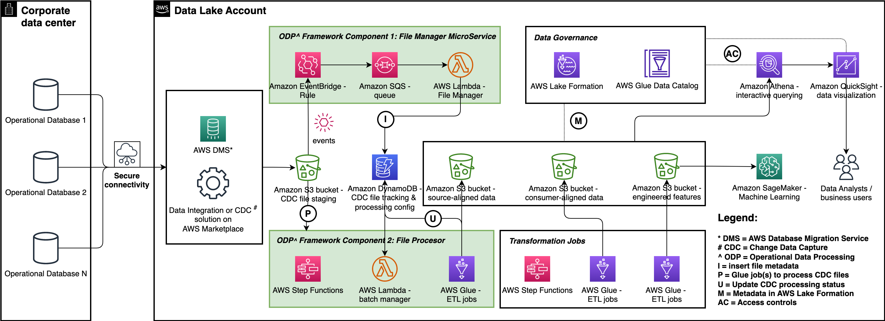

# Operational Data Processing Framework using AWS Glue and Apache Hudi

The Operational Data Processing Framework (ODP Framework) contains three components: 1/ File Manager, 2/ File Processor, and 3/ Configuration Manager. Each component runs independently to solve a portion of the operational data processing use case. The source code is organized in three folders – one for each component and if you customize and adopt this framework for your use cases, we recommend you to promote these components to three separate code repositories in your version control system. You can consider the following repository names:

1.	`aws-glue-hudi-odp-framework-file-manager`
2.	`aws-glue-hudi-odp-framework-file-processor`
3.	`aws-glue-hudi-odp-framework-config-manager`

With this modular approach, you can independently deploy the components to your data lake environment by following your preferred [CI/CD Processes](https://docs.aws.amazon.com/whitepapers/latest/practicing-continuous-integration-continuous-delivery/what-is-continuous-integration-and-continuous-deliverydeployment.html). As illustrated in the Overall Architecture section, these components are deployed in conjunction with a Change Data Capture solution. For the sake of completeness, we assume that AWS DMS is used to migrate data from operational databases to Amazon S3 but skip its implementation specifics.

---

## Contents

* [Data Lake Reference Architecture](#data-lake-reference-architecture)
* [ODP Framework Deep Dive and Deployment](#odp-framework-deep-dive-and-deployment)
* [ODP Framework Demo](#odp-framework-demo)
* [Authors](#authors)
* [License](#license)

---

## Data Lake Reference Architecture

A Data Lake solves a variety of Analytics and Machine Learning (ML) use cases dealing with internal and external data producers and consumers. We use a simplified and generic Data Lake reference architecture – illustrated in the diagram below. To ingest data from Operational Databases to Amazon S3 staging bucket of the data lake, either an [AWS Database Migration Service](https://aws.amazon.com/dms/) (DMS) or any AWS partner solution from AWS Marketplace that has support for [Change Data Capture](https://en.wikipedia.org/wiki/Change_data_capture) (CDC) can fulfil the requirement. [AWS Glue](https://aws.amazon.com/) is used to create source-aligned and consumer-aligned datasets and separate Glue jobs to do Feature Engineering part of ML Engineering and Operations. [Amazon Athena](https://aws.amazon.com/athena/) is used for interactive querying and [AWS Lake Formation](https://aws.amazon.com/lake-formation/) and Glue Data Catalog for Governance.

In our architecture, we used [AWS Database Migration Service](https://aws.amazon.com/dms/) (DMS) to ingest data from Operational Data Sources (ODS) to S3 staging layer of data lake. We used [AWS Glue](https://aws.amazon.com/) to run data ingestion and transformation pipelines. To populate Raw zones of the data lake, we used [Apache Hudi](https://hudi.apache.org/) as an [incremental data processing solution](https://hudi.apache.org/blog/2021/07/21/streaming-data-lake-platform/) in conjunction with [Apache Parquet](https://parquet.apache.org/). [Apache Hudi Connector for AWS Glue](https://aws.amazon.com/marketplace/pp/prodview-6rofemcq6erku) make it easy to use Apache Hudi within Glue ecosystem (Glue ETL and Glue Data Catalog). 

---

## ODP Framework Deep Dive and Deployment

Refer to:
1. [File Manager README](./file_manager/README.md).
2. [File Processor README](./file_processor/README.md).

---

## ODP Framework Demo

Refer to [ODP Framework Demo](./demo/README.md).

---

## Authors

The following people are involved in the design, architecture, development, and testing of this solution:

1. **Srinivas Kandi**, Data Architect, Amazon Web Services Inc.
1. **Ravi Itha**, Principal Consultant, Amazon Web Services Inc.

---

## License

This project is licensed under the Apache-2.0 License.

---