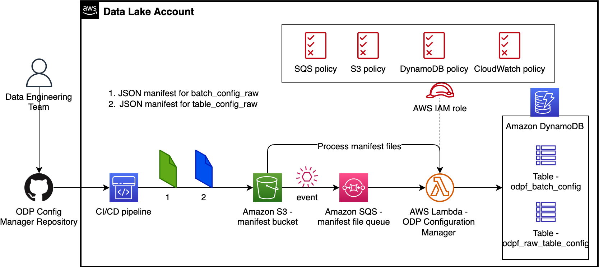
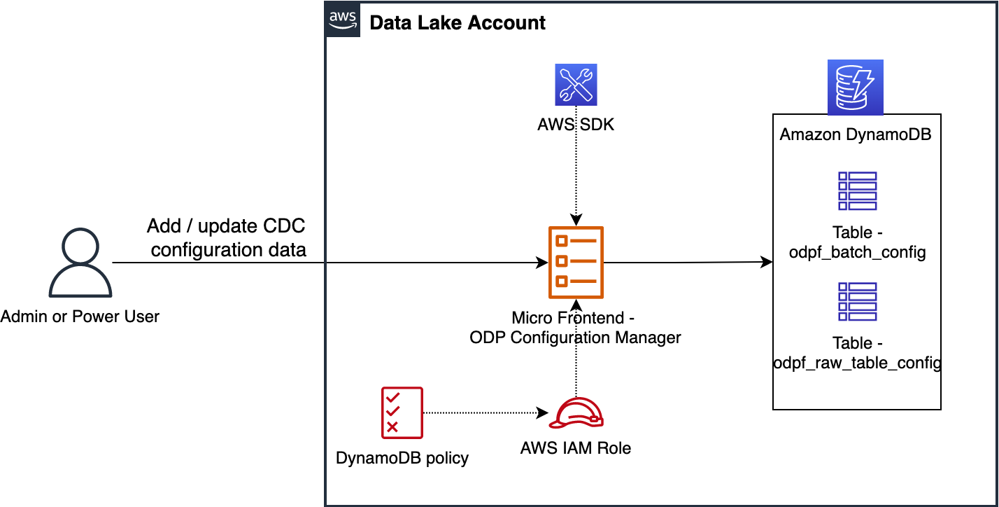

# Operational Data Processing Framework - Configuration Manager

Configuration Manager is used to insert Operational Tables' configuration details to `odpf_batch_config` and `odpf_raw_table_config` DynamoDB Tables which are used by the **File Processor**.

---

## Contents

* [Architecture](#architecture)
    * [Manifest-file-driven leveraging CI/CD Tooling and AWS Lambda](#manifest-file-driven-leveraging-CI-CD-Tooling-and-AWS-Lambda)
    * [Micro Frontend based solution](#micro-frontend-based-solution)
    * [Amazon DynamoDB Tables](#amazon-dynamodb-tables)
* [Authors](#authors)
* [License](#license)

---

## Architecture 

This current release of the ODP Framework provides two architecture patterns and leave the implementation details to the user / reader. Choose a pattern that best fits your needs.

---

### Manifest file driven leveraging CI/CD Tooling and AWS Lambda

With this option, you will implement Configuration Manager as an AWS Lambda Function which processes JSON manifest 
files from Amazon S3 bucket and inserts configuration record(s) to DynamoDB tables. Each configuration table needs a 
manifest file and the files are placed in an S3 bucket using a CI/CD pipeline (e.g., a pipeline in AWS CodePipeline 
configured against a Source Code Repository). Diagram below represents this architecture in detail.

---

### Micro Frontend based solution

With this option, you will implement Configuration Manager as a 
[Micro Frontend](https://martinfowler.com/articles/micro-frontends.html) on AWS to add configuration record(s) to 
DynamoDB tables as shown in the diagram below. If you build / host MicroServices on AWS in conjunction with Analytics 
layer then developing a Micro Frontend to achieve this functionality is an option to consider. 
To learn more, refer to [Micro-frontend Architectures on AWS](https://aws.amazon.com/blogs/architecture/micro-frontend-architectures-on-aws/).

---

### Amazon DynamoDB Tables

Configuration Manager deals with the following DynamoDB Tables: 

1. `odpf_batch_config`: Used to store unique refresh cadence with Glue worker type.
1. `odpf_raw_table_config`: Used to store configuration metadata for Operational Tables.
1. `odpf_config_deploy_tracker`: This talbe is used as an audit table for Configuration Manager where each time it inserts configuration metadata to `odpf_batch_config` and `odpf_raw_table_config` based on input (or JSON manifest file), it stores request details as-is for auditing purpose. It needs a Partition key - `source_table_name` (String).

---

## Authors

The following people are involved in the design, architecture, development, and testing of this solution:

1. **Srinivas Kandi**, Data Architect, Amazon Web Services Inc.
1. **Ravi Itha**, Principal Consultant, Amazon Web Services Inc.

---

## License

This project is licensed under the Apache-2.0 License.

---