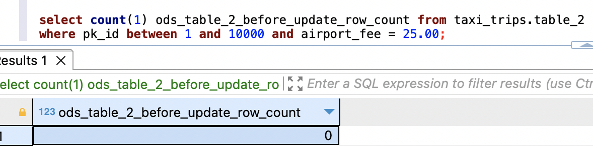
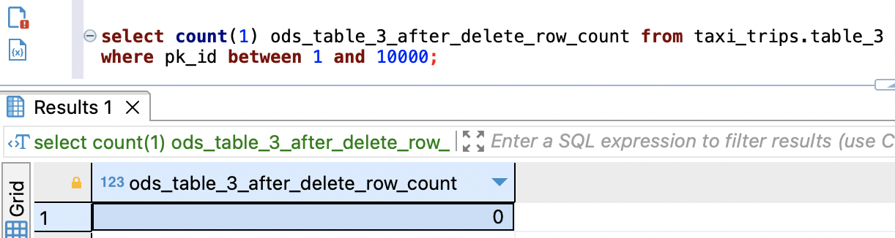

# Operational Data Processing Framework - Testing

This guide provides step-by-step instructions to test / demo Operational Data Processing Framework (ODP Framework). We'll replicate data from 18 operational tables to data lake and create source-aligned datasets with 10-minute refresh cadence. We will use [Amazon RDS for MySQL](https://aws.amazon.com/rds/mysql/) to setup an Operational Database with 18 Tables, upload New York City Taxi – Yellow Trip Data, setup AWS DMS to replicate data to Amazon S3, and process the files using the ODP Framework, and finally validate the data from Amazon Athena.

---

## Contents

* [AWS Service Requirements](#aws-service-requirements)
* [Create Amazon S3 Buckets](#create-amazon-s3-buckets)
* [Deploy File Manager and File Processor](#deploy-file-manager-and-file-processor)
* [Set up Operational Data Store](#set-up-operational-data-store)
* [Populate data to Operational Data Source](#populate-data-to-operational-data-source)
* [Configure DynamoDB Tables](#configure-dynamodb-tables)
* [Set up a Database in AWS Glue](#set-up-a-database-in-aws-glue)
* [Set up AWS DMS for CDC](#set-up-aws-dms-for-cdc)
* [File Manager Output](#file-manager-output)
* [File Processor Output](#file-processor-output)
* [Data Validation](#data-validation)
* [Extended Testing](#extended-testing)
   * [Incremental Changes to Multiple Tables](#incremental-changes-to-multiple-tables)
   * [Incremental Changes to One Table](#incremental-changes-to-one-table)
* [Authors](#authors)
* [License](#license)

---


## AWS Service Requirements

To demo ODP Framework, you will need the following AWS Services. 

1. 1 Amazon RDS for MySQL Database Instance
1. 1 AWS DMS Replication Instance
1. 2 AWS Glue Jobs
1. AWS services used by Operational Data Processing Framework Components [File Manager](../file_manager/README.md) and [File Processor](../file_processor/README.md)
1.  Amazon Athena for data analysis and validation

---

## Create Amazon S3 Buckets

1. Create three S3 buckets with the following names by following instructions from [this](https://docs.aws.amazon.com/AmazonS3/latest/userguide/create-bucket-overview.html) AWS documentation.
   1.	```odpf-demo-staging-EXAMPLE-BUCKET``` – you will use this to migrate operational data.
   2.	```odpf-demo-raw-EXAMPLE-BUCKET``` – you will use this to store source-aligned datasets.
   3.	```odpf-demo-code-artifacts-EXAMPLE-BUCKET``` – you will use this to store code artifacts.
1. Note: Optionally use Server Access Logging. For guidance, refer to [Logging requests using server access logging](https://docs.aws.amazon.com/AmazonS3/latest/userguide/ServerLogs.html).

___

## Deploy File Manager and File Processor 


1. Deploy File Manager using deployment instructions from [README](../file_manager/README.md).
1. Deploy File Processor using deployment instructions from [README](../file_processor/README.md).

---

## Set up Operational Data Store

Follow the steps below:

1.	Provision Amazon RDS for MySQL by following [this](https://aws.amazon.com/getting-started/hands-on/create-mysql-db/) tutorial.
2.	Connect to the database instance using [MySQL Workbench](https://www.mysql.com/products/workbench/) or [DBeaver](https://dbeaver.io/).
3.	Create a database (schema) by running the SQL command ```CREATE DATABASE taxi_trips;```.
4.	Create 18 Tables by running the SQL commands in this script. Start with table_1 and each time you run, increment the number to the next and stop when you finish creating all the 18 tables.

      ```sql
      CREATE TABLE `table_1` (
      `VendorID` bigint DEFAULT NULL,
      `tpep_pickup_datetime` timestamp NULL DEFAULT NULL,
      `tpep_dropoff_datetime` timestamp NULL DEFAULT NULL,
      `passenger_count` double DEFAULT NULL,
      `trip_distance` double DEFAULT NULL,
      `RatecodeID` double DEFAULT NULL,
      `store_and_fwd_flag` text,
      `PULocationID` bigint DEFAULT NULL,
      `DOLocationID` bigint DEFAULT NULL,
      `payment_type` bigint DEFAULT NULL,
      `fare_amount` double DEFAULT NULL,
      `extra` double DEFAULT NULL,
      `mta_tax` double DEFAULT NULL,
      `tip_amount` double DEFAULT NULL,
      `tolls_amount` double DEFAULT NULL,
      `improvement_surcharge` double DEFAULT NULL,
      `total_amount` double DEFAULT NULL,
      `congestion_surcharge` double DEFAULT NULL,
      `airport_fee` double DEFAULT NULL,
      `pk_id` bigint NOT NULL AUTO_INCREMENT,
      PRIMARY KEY (pk_id)
      );
      ```

---

## Populate data to Operational Data Source

Follow the steps below:

1.	Download New York City Taxi – Yellow Trip Data for Jan-2021. Go to [NYC TLC Trip Record Data](https://www.nyc.gov/site/tlc/about/tlc-trip-record-data.page), expand 2021, and click on `Yellow Taxi Trip records`.
1.	In Amazon S3, select S3 bucket ```odpf-demo-staging-<your-aws-account-id>``` and create a folder with name ```nyc_yellow_trip_data```.
1.	Upload ```yellow_tripdata_2021-01.parquet``` file to the folder.
1.	In Amazon S3, select S3 bucket ```odpf-demo-code-artifacts-<your-aws-account-id>```, and create a folder with name ```glue_scripts```.
1.	Download file [load_nyc_taxi_data_to_rds_mysql.py](./src/load_nyc_taxi_data_to_rds_mysql.py) from GitHub repo and upload it to the folder ```glue_scripts```.
1.	Create an AWS IAM Policy with name ```load_nyc_taxi_data_to_rds_mysql_s3_policy``` using [these](https://docs.aws.amazon.com/IAM/latest/UserGuide/access_policies_create-console.html#access_policies_create-json-editor) instructions. Use [this](./iam_policies/odpf_setup_test_data_glue_job_s3_policy.json) sample policy definition.
1.	Create an AWS IAM Role with name ```load_nyc_taxi_data_to_rds_mysql_role``` these instructions. Attach the policy created in the previous step.
1.	In AWS Glue, create a connection for Amazon RDS database:
      1.	Follow the instructions from [here](https://docs.aws.amazon.com/glue/latest/dg/console-connections-jdbc-drivers.html) and [here](https://docs.aws.amazon.com/glue/latest/dg/setup-vpc-for-glue-access.html).
      1.	Use the endpoint and database credentials belong to the Operational Data Source.
      1.	Give connection name as ```odpf_demo_rds_connection```.
1.	In AWS Glue, select **Glue ETL jobs**, select **Python Shell script editor**, select **Upload and edit an existing script** under options, choose the file ```load_nyc_taxi_data_to_rds_mysql.py```, click on **Create**, and complete remaining steps:
      1.	Under **Job details** tab, provide a name = ```load_nyc_taxi_data_to_rds_mysql```
      1.	IAM role = ```load_nyc_taxi_data_to_rds_mysql_role```
      1.	Data processing units = ```1/16 DPU```
      1.	Under **Advanced properties, Connections**, select the connection you created earlier.
      1.	Under **Job parameters**, add following parameters:
            1.	input_sample_data_path = ```s3://odpf-demo-staging-<your-aws-account-id>/nyc_yellow_trip_data/yellow_tripdata_2021-01.parquet```
            1.	schema_name = ```taxi_trips```
            1.	table_name = ```table_1```
            1.	rds_connection_name = ```odpf_demo_rds_connection```
      1.	Click on **Save**.
1.	From the **Actions** drop down, run the job.
1.	Go back to your  MySQL Workbench or DBeaver and validate the record count by running the SQL command ```select count(1) row_count from taxi_trips.table_1```. You will get an output as ```1369769```.
1.	Populate remaining 17 Tables by running the following SQL commands one at a time.

      ```sql
         insert into taxi_trips.table_2 select * from taxi_trips.table_1;
         insert into taxi_trips.table_3 select * from taxi_trips.table_1;
         insert into taxi_trips.table_4 select * from taxi_trips.table_1;
         insert into taxi_trips.table_5 select * from taxi_trips.table_1;
         insert into taxi_trips.table_6 select * from taxi_trips.table_1;
         insert into taxi_trips.table_7 select * from taxi_trips.table_1;
         insert into taxi_trips.table_8 select * from taxi_trips.table_1;
         insert into taxi_trips.table_9 select * from taxi_trips.table_1;
         insert into taxi_trips.table_10 select * from taxi_trips.table_1;
         insert into taxi_trips.table_11 select * from taxi_trips.table_1;
         insert into taxi_trips.table_12 select * from taxi_trips.table_1;
         insert into taxi_trips.table_13 select * from taxi_trips.table_1;
         insert into taxi_trips.table_14 select * from taxi_trips.table_1;
         insert into taxi_trips.table_15 select * from taxi_trips.table_1;
         insert into taxi_trips.table_16 select * from taxi_trips.table_1;
         insert into taxi_trips.table_17 select * from taxi_trips.table_1;
         insert into taxi_trips.table_18 select * from taxi_trips.table_1;
      ```
1.	Get row count from 18 Table by running the following SQL commands together. You will get an output as follows:

      ```sql
         select 'table_1' table_name, count(1) count from taxi_trips.table_1
         union all
         select 'table_2' table_name, count(1) count from taxi_trips.table_2
         union all
         select 'table_3' table_name, count(1) count from taxi_trips.table_3
         union all
         select 'table_4' table_name, count(1) count from taxi_trips.table_4
         union all
         select 'table_5' table_name, count(1) count from taxi_trips.table_5
         union all
         select 'table_6' table_name, count(1) count from taxi_trips.table_6
         union all
         select 'table_7' table_name, count(1) count from taxi_trips.table_7
         union all
         select 'table_8' table_name, count(1) count from taxi_trips.table_8
         union all
         select 'table_9' table_name, count(1) count from taxi_trips.table_9
         union all
         select 'table_10' table_name, count(1) count from taxi_trips.table_10
         union all
         select 'table_11' table_name, count(1) count from taxi_trips.table_11
         union all
         select 'table_12' table_name, count(1) count from taxi_trips.table_12
         union all
         select 'table_13' table_name, count(1) count from taxi_trips.table_13
         union all
         select 'table_14' table_name, count(1) count from taxi_trips.table_14
         union all
         select 'table_15' table_name, count(1) count from taxi_trips.table_15
         union all
         select 'table_16' table_name, count(1) count from taxi_trips.table_16
         union all
         select 'table_17' table_name, count(1) count from taxi_trips.table_17
         union all
         select 'table_18' table_name, count(1) count from taxi_trips.table_18;
      ```

1. You will get an output similar to the following screenshot

   

---

## Configure DynamoDB Tables

Follow the steps below:

1.	Download file [load_ops_table_configs_to_ddb.py](./src/load_ops_table_configs_to_ddb.py) from GitHub repo and upload it to the folder ```glue_scripts```.
1.	Create an AWS IAM Policy with name ```load_ops_table_configs_to_ddb_ddb_policy``` using [these](https://docs.aws.amazon.com/IAM/latest/UserGuide/access_policies_create-console.html#access_policies_create-json-editor) instructions. Use [this](./iam_policies/odpf_setup_test_data_glue_job_ddb_policy.json) sample policy definition.
1.	Create an AWS IAM Role with name ```load_ops_table_configs_to_ddb_role``` using [these](https://docs.aws.amazon.com/IAM/latest/UserGuide/id_roles_create_for-service.html#roles-creatingrole-service-console) instructions. Attach the policy created in the previous step.
1.	In AWS Glue, select **Glue ETL jobs**, select **Python Shell script editor**, select **Upload and edit an existing script** under options, choose the file ```load_ops_table_configs_to_ddb.py```, click on **Create** and complete the remaining steps.
      1.	Under **Job details** tab, provide a name = ```load_ops_table_configs_to_ddb```
      1.	IAM role = ```load_ops_table_configs_to_ddb_role```
      1.	Data processing units = ```1/16 DPU```
      1.	Under Job parameters, add following parameters
            1.	batch_config_ddb_table_name = ```odpf_batch_config```
            1.	raw_table_config_ddb_table_name = ```odpf_demo_taxi_trips_raw```
            1.	aws_region = ```us-west-1```
      1.	Click on **Save**
1.	From the **Actions** drop down, run the job.
1.	In Amazon DynamoDB console, get item count from the Tables. 
1. You will find 1 item in `odpf_batch_config` Table.

   

1. You will find 18 items in `odpf_raw_table_config` Table.

   

---

## Set up a Database in AWS Glue

Follow the steps below:

1.	Go to AWS Glue, go to Data catalog, and then to Databases.
2.	Add a database with name `odpf_demo_taxi_trips_raw`.

---

## Set up AWS DMS for CDC

To set up DMS Replication instance, endpoints, and replication task, follow the instructions below.

1. Create DMS replication instance by following instructions from either [Creating a replication instance](https://docs.aws.amazon.com/dms/latest/userguide/CHAP_ReplicationInstance.Creating.html) or [How do I create a Replication Instance in AWS DMS?](https://www.youtube.com/watch?v=RdR4V7LTN8A). We have used `dms.t3.medium` instance.

1. Create source endpoint for Amazon RDS for MySQL by following instructions from [Create an AWS DMS Source Endpoint](https://docs.aws.amazon.com/dms/latest/sbs/chap-rdssqlserver2s3datalake.steps.sourceendpoint.html). **Note:** You will select the Amazon RDS for MySQL.

1. Create target endpoint for Amazon S3 by following instructions from [Can I use an Amazon S3 bucket as an AWS Database Migration Service target?](https://repost.aws/knowledge-center/s3-bucket-dms-target). Configure S3 endpoint settings using [this JSON definition](./dms_settings/dms_s3_endpoint_setting.json). **Note:** The bucket folder must match with the folder that is used to enable S3 event notifications in the [File Manager Deployment](../aws-glue-hudi-odp-framework-file-manager/README.md).

1. Create a DMS Task by following instructions from [Create an AWS DMS Task](https://docs.aws.amazon.com/dms/latest/sbs/chap-rdssqlserver2s3datalake.steps.createtask.html). 
   1. Use the Source and Target Endpoints created in the previous steps
   1. DMS Task Mapping Rules Reference = [DMS Mapping Rules](./dms_settings/dms_task_mapping_rules.json).
   1. Choose the following option for Task startup configuration

      

1. Once the DMS Task starts running, you will see the following

   

1. The screenshot below represents Table statistics collected by the AWS DMS Task. The Full load rows and Total rows are important metrics whose counts match with the record volumes of RDS for MySQL database.

   

1. As expected, as a result of successful full load completion, we noticed the presence of Parquet files in Amazon S3 Staging bucket – one Parquet file per Table in its dedicated folder. The screenshot below represents the Parquet file for Table 1 and there are 17 such folders exist in the S3 Staging bucket.

   

---

## File Manager Output

File Manager Lambda Function consumes messages from the SQS queue, extract metadata for the CDC files, and insert one item per file to `odpf_file_tracker` DynamoDB Table. When you check the items, you will find 18 items with `file_ingestion_status` set to `raw_file_landed` as shown in the screenshot below.

   

---

## File Processor Output

1. On the subsequent 10th minute (since the activation of the EventBridge Rule activation), Event Rule triggers File Processor State Machine. On the AWS Step Functions console, you will notice that the state machine is invoked as shown in the screenshot below.

   

1. As shown in the screenshot below, Batch Generator Lambda created 4 batches, constructed a Map state for parallel running of File Processor Trigger Lambda. Within each item in the state, File Processor Trigger Lambda invokes File Processor Glue Job. Across 4 batches and 4 Glue Job invocations as shown in the screenshot below, the state machine processes CDC files for 18 Operational Tables.

   

1. In AWS Glue Data Catalog, you will notice 18 Tables created in `odpf_demo_taxi_trips_raw` Database as similar to the screenshot below.

   

1. You will notice that the File Processor Glue Jobs create source-aligned datasets in Hudi format in the Amazon S3 Raw bucket. For Table 1, you will see an output similar to the screenshot below. There will be 17 such folders exist in the Amazon S3 Raw bucket.

   

1. You will notice that, the records belong to successfully processed CDC files from `odpf_file_tracker` to `odpf_file_tracker_history` Table with file_ingestion_status set to `raw_file_processed`. The screenshot represent the records from `odpf_file_tracker_history` Table.

   

1. In the `odpf_file_processing_tracker` DynamoDB Table, you will find 18 records.

   


1. In the `odpf_file_processing_tracker_history` DynamoDB Table, you will find 18 records.

   

---

## Data Validation

1.	Go to Amazon Athena console, open Query editor, and select a Workgroup or create one by following [these](https://docs.aws.amazon.com/athena/latest/ug/workgroups-procedure.html) instructions.
    1. **Note:** NYC Taxi Trip Report data does not have any sensitive data. So querying this data via Athena does not require you to encrypt the Athena Query Results. For more details on this topic, refer to [Encrypting Athena query results stored in Amazon S3](https://docs.aws.amazon.com/athena/latest/ug/encrypting-query-results-stored-in-s3.html).
1.	Select AwsDataCatalog for **Data source** and select ```odpf_demo_taxi_trips_raw``` for **database**.
1.	Run the following SQL query. You will get an output similar to the screenshot below.

      ```sql
         select 'table_1' table_name, count(1) row_count from odpf_demo_taxi_trips_raw.table_1
         union all
         select 'table_2' table_name, count(1) row_count from odpf_demo_taxi_trips_raw.table_2
         union all
         select 'table_3' table_name, count(1) row_count from odpf_demo_taxi_trips_raw.table_3
         union all
         select 'table_4' table_name, count(1) row_count from odpf_demo_taxi_trips_raw.table_4
         union all
         select 'table_5' table_name, count(1) row_count from odpf_demo_taxi_trips_raw.table_5
         union all
         select 'table_6' table_name, count(1) row_count from odpf_demo_taxi_trips_raw.table_6
         union all
         select 'table_7' table_name, count(1) row_count from odpf_demo_taxi_trips_raw.table_7
         union all
         select 'table_8' table_name, count(1) row_count from odpf_demo_taxi_trips_raw.table_8
         union all
         select 'table_9' table_name, count(1) row_count from odpf_demo_taxi_trips_raw.table_9
         union all
         select 'table_10' table_name, count(1) row_count from odpf_demo_taxi_trips_raw.table_10
         union all
         select 'table_11' table_name, count(1) row_count from odpf_demo_taxi_trips_raw.table_11
         union all
         select 'table_12' table_name, count(1) row_count from odpf_demo_taxi_trips_raw.table_12
         union all
         select 'table_13' table_name, count(1) row_count from odpf_demo_taxi_trips_raw.table_13
         union all
         select 'table_14' table_name, count(1) row_count from odpf_demo_taxi_trips_raw.table_14
         union all
         select 'table_15' table_name, count(1) row_count from odpf_demo_taxi_trips_raw.table_15
         union all
         select 'table_16' table_name, count(1) row_count from odpf_demo_taxi_trips_raw.table_16
         union all
         select 'table_17' table_name, count(1) row_count from odpf_demo_taxi_trips_raw.table_17
         union all
         select 'table_18' table_name, count(1) row_count from odpf_demo_taxi_trips_raw.table_18;
      ```

1. You get the following output. Here, you will notice that these counts will match with the counts of Operational Tables in the Amazon RDS for MySQL.

   

---

## Extended Testing

We test the following scenarios:

1. Incremental Changes to Multiple Tables
1. Incremental Changes to One Table

---

### Incremental Changes to Multiple Tables

We will test some additional scenarios. We take 3 Operational Tables, insert 20,000 records to `table_1`, update 10,000 records in `table_2`, and delete 10,000 records from `table_3`. We take the row counts before making changes and after making these changes to Operational Tables. We validate the following: 1/ Table statistics from AWS DMS Task, 2/ CDC files in S3 staging bucket, items in `odpf_file_tracker` table, File Processor run details, and finally we take the row counts from Hudi Raw Tables via Athena.

1. From Operational Database, get the row counts from `table_1`, `table_2`, and `table_3` by running the following SQL queries.

   | Table 1: Before Insert Row Count  | Table 2: Before Update Row Count | Table 3: Before Delete Row Count| 
   |----------------|----------------|---------------|
   | `select count(1) ods_table_1_before_insert_row_count from taxi_trips.table_1;`| `select count(1) ods_table_2_before_update_row_count from taxi_trips.table_2 where pk_id between 1 and 10000 and airport_fee = 25.00;`| `select count(1) ods_table_3_before_delete_row_count from taxi_trips.table_3 where pk_id between 1 and 10000;` |
   |  |  |  |

1. From Amazon Athena, get the row counts from `table_1`, `table_2`, and `table_3` by running the following SQL queries.

   | Table 1: Before Insert Row Count  | Table 2: Before Update Row Count | Table 3: Before Delete Row Count| 
   |----------------|----------------|---------------|
   | `select count(1) hudi_table_1_before_insert_row_count from odpf_demo_taxi_trips_raw.table_1;`| `select count(1) hudi_table_2_before_update_row_count from odpf_demo_taxi_trips_raw.table_2 where pk_id between 1 and 10000 and airport_fee = 25.00;`| `select count(1) hudi_table_3_before_delete_row_count from odpf_demo_taxi_trips_raw.table_3 where pk_id between 1 and 10000;` |
   |  |  |  |

1. Insert 20,000 rows to `taxi_trips.table_1` by running the following SQL Command.

   ```sql
   insert into taxi_trips.table_1
      (VendorID,
      tpep_pickup_datetime,
      tpep_dropoff_datetime,
      passenger_count,
      trip_distance,
      RatecodeID,
      store_and_fwd_flag,
      PULocationID,
      DOLocationID,
      payment_type,
      fare_amount,
      extra, mta_tax,
      tip_amount, tolls_amount,
      improvement_surcharge,
      total_amount,
      congestion_surcharge,
      airport_fee)
   SELECT
      VendorID,
      tpep_pickup_datetime,
      tpep_dropoff_datetime,
      passenger_count,
      trip_distance,
      RatecodeID,
      store_and_fwd_flag,
      PULocationID,
      DOLocationID,
      payment_type,
      fare_amount,
      extra, mta_tax,
      tip_amount, tolls_amount,
      improvement_surcharge,
      total_amount,
      congestion_surcharge,
      airport_fee
   FROM taxi_trips.table_1 where pk_id < 20001;
   ```

1. Update 10,000 rows to `taxi_trips.table_2` by running the following SQL Command.

   ```sql
   update taxi_trips.table_2 set airport_fee = 25.00 where pk_id between 1 and 10000;
   ```

1. Delete 10,000 rows to `taxi_trips.table_3` by running the following SQL Command.

   ```sql
   delete from table_3 where pk_id between 1 and 10000;
   ```

1. From Operational Database, get the row counts from `table_1`, `table_2`, and `table_3` by running the following SQL queries.

   | Table 1: After Insert Row Count  | Table 2: After Update Row Count | Table 3: After Delete Row Count| 
   |----------------|----------------|---------------|
   | `select count(1) ods_table_1_after_insert_row_count from taxi_trips.table_1;`| `select count(1) ods_table_2_after_update_row_count from taxi_trips.table_2 where pk_id between 1 and 10000 and airport_fee = 25.00;`| `select count(1) ods_table_3_after_delete_row_count from taxi_trips.table_3 where pk_id between 1 and 10000;` |
   |  |  |  |

1. Go to DMS Task and verify Table Statistics. You will see something similar to the following:

   

1. Go to S3 Staging Bucket, browse through Table folder and verify the CDC file(s). You will see something similar to the following: 

   

1. Go to DynamoDB Table `odpf_file_tracker`, browse the items. You will see something similar to the following: 

   

1. Go to File Processor Glue job in AWS Glue console, You will see something similar to the following: 

   

1. Go to Amazon Athena console, in Query Editor, run the following SQL commands to verify the record counts from `table_1`, `table_2`, and `table_3`.

   | Table 1: After Insert Row Count  | Table 2: After Update Row Count | Table 3: After Delete Row Count| 
   |----------------|----------------|---------------|
   | `select count(1) hudi_table_1_after_insert_row_count from odpf_demo_taxi_trips_raw.table_1;`| `select count(1) hudi_table_2_after_update_row_count from odpf_demo_taxi_trips_raw.table_2 where pk_id between 1 and 10000 and airport_fee = 25.00;`| `select count(1) hudi_table_3_after_delete_row_count from odpf_demo_taxi_trips_raw.table_3 where pk_id between 1 and 10000;` |
   |  |  |  |

1. **Conclusion:** Per the above screenshot, you will notice the following: 1/ 20,000 records inserted to `table_1`, 2/ 10,000 records were updated in `table_2`, and 3/ 10,000 records were deleted from `table_3`. These were the same number of records changed in the Operational Database and the ODP Framework has worked as expected.

---

### Incremental Changes to One Table

We take one Operational Table, insert a record to `table_10`, update the record twice, delete the record, insert the record again, and finally update it. We validate the following: 1/ Table statistics from AWS DMS Task, 2/ CDC files in S3 staging bucket, items in `odpf_file_tracker` table, File Processor run details, and finally we take the row counts from Hudi Raw Tables via Athena.

1. Run the following SQL commands to ensure no record exist in `table_10` either in Operational Database or in Glue Database `odpf_demo_taxi_trips_raw`.

   | Table 1: Record status in ODS before testing  | Table 2: Record status in Raw Glue Database before testing |
   |----------------|----------------|
   | `select pk_id, airport_fee from taxi_trips.table_10 where pk_id = 1369770;`| `select pk_id, airport_fee from odpf_demo_taxi_trips_raw.table_10 where pk_id = 1369770;`| 
   |  |  |

1. Insert a record to `table_10` by running the following SQL command.

   ```sql
   INSERT into taxi_trips.table_10
      (VendorID,
      tpep_pickup_datetime,
      tpep_dropoff_datetime,
      passenger_count,
      trip_distance,
      RatecodeID,
      store_and_fwd_flag,
      PULocationID,
      DOLocationID,
      payment_type,
      fare_amount,
      extra, mta_tax,
      tip_amount, tolls_amount,
      improvement_surcharge,
      total_amount,
      congestion_surcharge,
      airport_fee,
      pk_id)
   SELECT
      VendorID,
      tpep_pickup_datetime,
      tpep_dropoff_datetime,
      passenger_count,
      trip_distance,
      RatecodeID,
      store_and_fwd_flag,
      PULocationID,
      DOLocationID,
      payment_type,
      fare_amount,
      extra, mta_tax,
      tip_amount, tolls_amount,
      improvement_surcharge,
      total_amount,
      congestion_surcharge,
      50.00,
      1369770
   FROM taxi_trips.table_10 where pk_id < 2;
   ```

1. Update the newly inserted record (set `airport_fee` to $60) by running the following SQL command.

   ```sql
   update taxi_trips.table_10 set airport_fee = 60.00 where pk_id = 1369770;
   ```

1. Update the record (set `airport_fee` to $70) by running the following SQL command.

   ```sql
   update taxi_trips.table_10 set airport_fee = 70.00 where pk_id = 1369770;
   ```

1. Delete the record by running the following SQL command.

   ```sql
   delete from taxi_trips.table_10 where pk_id = 1369770;
   ```
1. Insert a record to `table_10` by running the following SQL command.

   ```sql
   INSERT into taxi_trips.table_10
      (VendorID,
      tpep_pickup_datetime,
      tpep_dropoff_datetime,
      passenger_count,
      trip_distance,
      RatecodeID,
      store_and_fwd_flag,
      PULocationID,
      DOLocationID,
      payment_type,
      fare_amount,
      extra, mta_tax,
      tip_amount, tolls_amount,
      improvement_surcharge,
      total_amount,
      congestion_surcharge,
      airport_fee,
      pk_id)
   SELECT
      VendorID,
      tpep_pickup_datetime,
      tpep_dropoff_datetime,
      passenger_count,
      trip_distance,
      RatecodeID,
      store_and_fwd_flag,
      PULocationID,
      DOLocationID,
      payment_type,
      fare_amount,
      extra, mta_tax,
      tip_amount, tolls_amount,
      improvement_surcharge,
      total_amount,
      congestion_surcharge,
      80.00,
      1369770
   FROM taxi_trips.table_10 where pk_id < 2;
   ```

1. Update the newly inserted record (set `airport_fee` to $60) by running the following SQL command.

   ```sql
   update taxi_trips.table_10 set airport_fee = 100.00 where pk_id = 1369770;
   ```

1. Verify the record in `table_10` by running the following SQL command.

   ```sql
   select pk_id, airport_fee from taxi_trips.table_10 where pk_id = 1369770;
   ```

1. Go to S3 Staging Bucket, browse through Table folder and verify the CDC file(s). You will see something similar to the following: 

   

1. Notes: 

   1. Four of the five files have one record each and the fifth file has the two records. The screenshot below represents those two records.

      
   
   1. How DMS packs those records into files is based on the time gap between consecutive insert / update / deletes to a given table. The number of files you get may be different.

1. Go to DynamoDB Table `odpf_file_tracker`, browse the items. You will see something similar to the following: 

   

1. Open File Processor Glue Job that processed CDC files, go to its CloudWatch Logs. You will see something similar to the following. Takeaway: Out of 5 CDC files for `table_10`, File Processor Glue Job selected only one record as per the configuration setting. See the point **Conclusion** for more details.

   

1. Go to DynamoDB table `odpf_file_processing_tracker_history` in DynamoDB console, You will see something similar to the following: 

   

1. Go to Amazon Athena console, in Query Editor, run the following SQL commands to verify the record from `table_10`.

   

1. **Takeaways:** 

   1. Each insert, update, delete operation resulted in CDC record resulted in a total of 6 records in the following order insert, update, update, delete, insert, and update.
   1. Since `table_10` in `odpf_raw_table_config` DynamoDB Table  is configured with `table_data_versioning_type` = `S` (per the screenshot below), File Processor Glue Job only processed the sixth CDC record. 

      

---

## Authors

The following people are involved in the design, architecture, development, and testing of this solution:

1. **Srinivas Kandi**, Data Architect, Amazon Web Services Inc.
1. **Ravi Itha**, Principal Consultant, Amazon Web Services Inc.

---

## License

This project is licensed under the Apache-2.0 License.

---