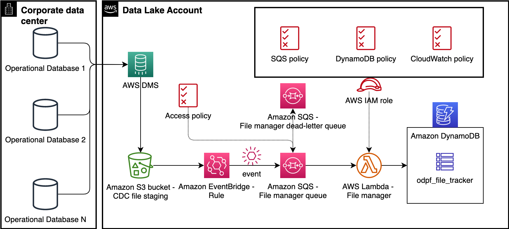

# Operational Data Processing Framework - File Manager

File Manager detects and tracks CDC files emitted by AWS DMS replication tasks. The files detected by the File Manager will be processed by File Processor.

---

## Contents

* [Architecture](#architecture)
* [AWS Service Requirements](#aws-service-requirements)
* [Prerequisites](#prerequisites)
    * [Create Amazon S3 Buckets](#create-amazon-s3-buckets)
* [Manual Deployment](#manual-deployment)
    * [Create Amazon SQS Queues](#create-amazon-sqs-queues)
    * [Enable Event Bridge Notifications on S3 Staging Bucket](#enable-event-bridge-notifications-on-s3-staging-bucket)
    * [Create EventBridge Rule](#create-eventbridge-rule)
    * [Create Amazon DynamoDB Tables](#create-amazon-dynamodb-tables)
    * [Deploy File Manager](#deploy-file-manager)
* [Authors](#authors)
* [License](#license)

---

## Architecture

File Manager detects files emitted by a CDC process such as AWS DMS and tracks them in an [Amazon DynamoDB](https://aws.amazon.com/dynamodb/) table. As shown in the diagram below, it consists of: 1/ [Amazon EventBridge](https://aws.amazon.com/eventbridge/) Event Rule, 2/ [Amazon Simple Queue Service](https://aws.amazon.com/sqs/) (SQS) queue, 3/ [AWS Lambda](https://aws.amazon.com/lambda/) function, and 4/ DynamoDB table. Amazon EventBridge Event Rule leverages [Amazon S3 Event Notifications](https://docs.aws.amazon.com/AmazonS3/latest/userguide/EventNotifications.html) to detect the arrival of CDC files in S3 bucket. The Event Rule forwards object event notifications to Amazon SQS queue as messages. File Manager Lambda function consumes those messages, parses metadata, and inserts metadata to an DynamoDB Table `odpf_file_tracker`. These records will then be processed by File Processor which we discuss in the next section.

---

## AWS Service Requirements

File Manager requires the following AWS resources:

 1. 1 Amazon S3 Bucket
 1. 1 Amazon EventBridge Event Rule
 1. 2 Amazon SQS Queues
 1. 2 Amazon DynamoDB Tables
 1. 1 AWS IAM Role
 1. 1 AWS Lambda Function

---

## Prerequisites

Provisioning of AWS resources documented in this section are usually outside of the scope of File Manager.

### Create Amazon S3 buckets

1. Create 2 Amazon S3 buckets
    1. S3 Staging bucket - AWS DMS will migrate data to this bucket
    1. S3 bucket for Server Access Logging. For guidance, refer to [Logging requests using server access logging](https://docs.aws.amazon.com/AmazonS3/latest/userguide/ServerLogs.html).
1. **Notes:**
    1. Under ***Block Public Access settings for this bucket***, make sure option **Block all public access** is enabled.
    1. Enable Server-side encryption based on your organizational best practices. Refer to [Protecting data using server-side encryption](https://docs.aws.amazon.com/AmazonS3/latest/userguide/serv-side-encryption.html) for more details.
**Note:** As a best practice, Amazon S3 buckets are generally provisioned using Data Lake Infrastructure Module. To know more about this mechanism, refer to AWS DevOps Blog [Deploy data lake ETL jobs using CDK Pipelines](https://aws.amazon.com/blogs/devops/deploying-data-lake-etl-jobs-using-cdk-pipelines/).

---

## Manual Deployment

This section contains manual deployment instructions. 

**Note:**

You can use AWS X-Ray to visualize AWS Lambda functions, identify performance bottlenecks, and troubleshoot requests that resulted in an error. Lambda functions send trace data to X-Ray, and X-Ray processes the data to generate a service map and searchable trace summaries. For more details, refer to [Using AWS Lambda with AWS X-Ray](https://docs.aws.amazon.com/lambda/latest/dg/services-xray.html).

---

### Create Amazon SQS Queues

1. Go to Amazon SQS console, click on Create a queue
    1. Type = Standard
    1. Name = `odpf_file_manager_queue`
    1. Use the default values for all other settings
    1. Choose Create queue
1. Create a dead letter queue with name `odpf_file_manager_dlq` by repeating the above process
1. Go to queue `odpf_file_manager_queue`, click Edit
    1. Under **Dead-letter queue**
    1. For option, **Set this queue to receive undeliverable messages**, select **Enabled**
    1. Choose queue = `odpf_file_manager_dlq`
    1. Maximum receives = e.g., 3
    1. Click **Save**

---

### Enable Event Bridge Notifications on S3 Staging Bucket

1. Go to S3 Staging Bucket
1. Click **Properties** tab
2. At Amazon EventBridge section,  click Edit
1. Select On for **Send notifications to Amazon EventBridge for all events in this bucket**
1. Click **Save changes**

---

## Create EventBridge Rule

1. Go to Amazon EventBridge
1. Buses --> Rules --> select **Create Rule**
1. Provide a name
1. For Rule type, select option, **Rule with an event pattern**, click Next
1. Under Event source, select **AWS events or EventBridge partner events**
1. Under section Creation method, select option **Use pattern form**
1. Under Event Pattern,
    1. Event source = AWS services
    1. AWS Service = Simple Storage Service (S3)
    1. Event Type = Amazon S3 Event Notification
    1. Select Specific event(s) = Object Created
    1. Specific bucket(s) by name = **Type the S3 Staging Bucket Used**
    1. Click Next
1. Under Under Select target(s)
    1. Target Type = AWS service
    1. Select a Target = SQS
    1. Queue = E.g., ***odpf_file_manager_queue***
    1. Click Next
1. Under Tags section, provide tags of your choice, click Next
1. Under Review and create section, click **Create rule** button

---

### Create Amazon DynamoDB Tables

1. Create Amazon DynamoDB Tables using the following details. You can select **Default  settings** option under **Table settings** for this purpose.

    | Table             | Purpose        |  Schema      |  Capacity      |
    |-------------------|----------------| ------------ | -------------- |
    | `odpf_file_tracker` | Used to store DMS files metadata | Partition key - `source_table_name` (String), Sort key - `file_id` (Number) | On-Demand |
    | `odpf_file_tracker_history` | Used to stored processed DMS files | Partition key - `source_table_name` (String), Sort key - `file_id` (Number) | On-Demand |

---

### Deploy File Manager

1. Create following IAM policies
   1. IAM policy with name `odpf_file_manager_ddb_policy` using [this sample](./iam_policies/odpf_file_manager_ddb_policy.json)
   1. IAM policy with name `odpf_file_manager_sqs_policy` using [this sample](./iam_policies/odpf_file_manager_sqs_policy.json)
1. Create an IAM role with name `odpf_file_manager_iam_role`
   1. Trusted entity type: Select **AWS service** followed by **Lambda**
   1. Attach following IAM policies to the role
      1. `odpf_file_manager_ddb_policy`
      1. `odpf_file_manager_sqs_policy`
      1. AWS Managed policy ARN `arn:aws:iam::aws:policy/service-role/AWSLambdaVPCAccessExecutionRole`
1. Deploy **File Manager** Lambda function
    1. Function name = `odpf_file_manager`
    1. Runtime = Python 3.11
    1. IAM role = Select `odpf_file_manager_iam_role`
    1. Function code = Copy the contents from [odpf_file_manager.py](./src/odpf_file_manager.py)
    1. Under Configuration --> Environment variables, create following variables:
        1. BATCH_CONFIG_DDB_TABLE_NAME = `odpf_batch_config`
        1. RAW_TABLE_CONFIG_DDB_TABLE_NAME = `odpf_raw_table_config`
    1. Under Configuration --> General configuration, set the values as follows:
        1. Timeout = e.g. 1 minute
        1. Memory = e.g. 128 MB

---

## Authors

The following people are involved in the design, architecture, development, and testing of this solution:
1. **Srinivas Kandi**, Data Architect, Amazon Web Services Inc.
2. **Ravi Itha**, Principal Consultant, Amazon Web Services Inc.

---

## License

This project is licensed under the Apache-2.0 License.

---