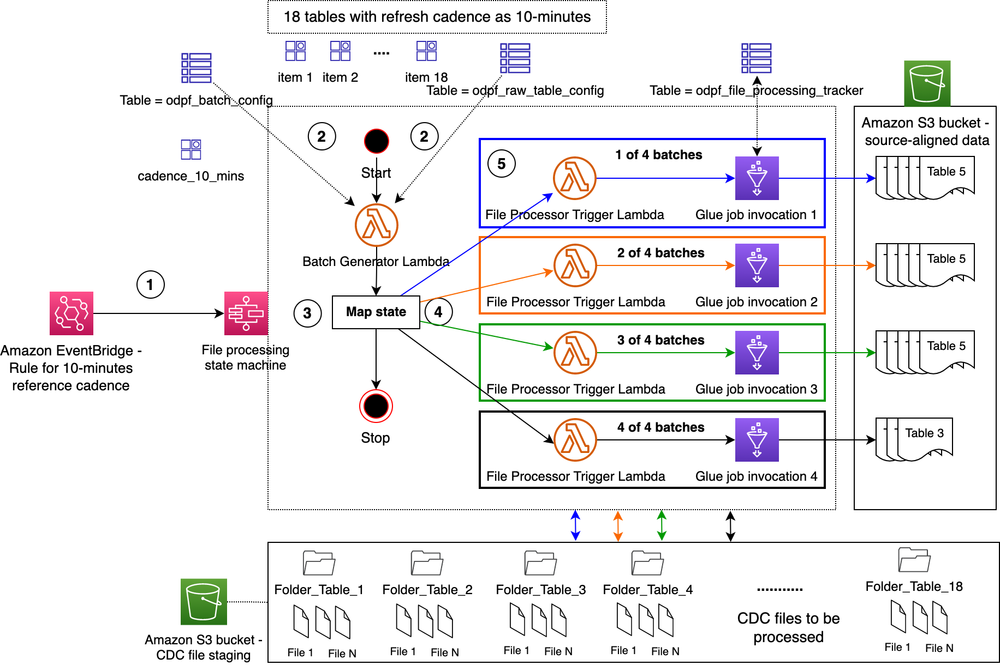
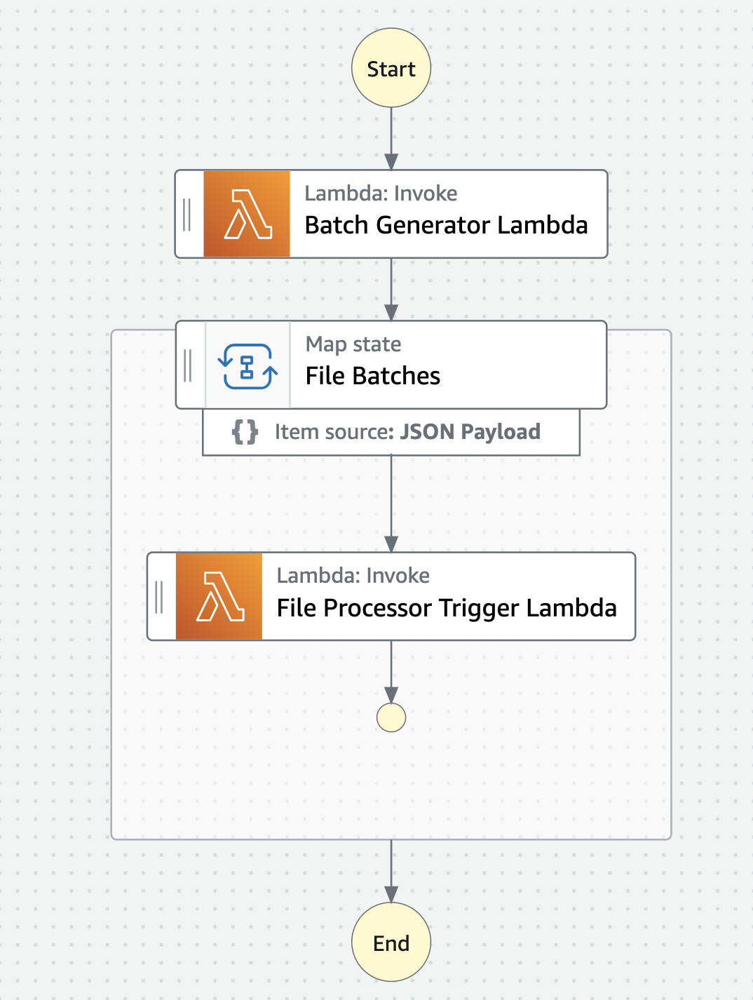

# Operational Data Processing Framework - File Processor

File processor is the workhorse of ODP Framework. It processes files from staging S3 bucket, creates source-aligned datasets in Raw S3 bucket, and add / updates metadata for source-aligned datasets (Glue Tables) in AWS Glue Data Catalog.

---

## Contents

* [File Processor](#file-processor)
    * [Terminology](#terminology)
    * [Amazon DynamoDB Tables](#amazon-dynamodb-tables)
    * [Schema Definition for odpf_batch_config](#schema-definition-for-odpf_batch_config)
    * [Schema Definition for odpf_raw_table_config](#schema-definition-for-odpf_raw_table_config)
    * [Architecture](#architecture)
* [AWS Service Requirements](#aws-service-requirements)
* [Manual Deployment](#manual-deployment)
    * [Create Amazon S3 Buckets](#create-amazon-s3-buckets)
    * [Create Amazon DynamoDB Tables](#create-amazon-dynamodb-tables)
    * [Deploy Batch Generator Lambda](#deploy-batch-generator-lambda)
    * [Deploy File Processor Glue Job Trigger Lambda](#deploy-file-processor-glue-job-trigger-lambda)
    * [Deploy File Processor Glue Job](#deploy-file-processor-glue-job)
    * [Deploy File Processor State Machine](#deploy-file-processor-state-machine)
    * [Deploy File Processor State Machine EventBridge Rule](#deploy-file-processor-state-machine-eventbridge-rule)
* [Authors](#authors)
* [License](#license)

---

## File Processor

This section provides File Processor Architecture details.

### Terminology

1.	Refresh cadence: It represents data ingestion frequency e.g., 10-minutes. It usually goes Glue worker type (one of G.1X, G.2X, G.4X, G.8X, G.025X etc.) and batch size. Example: All Operational Tables are classified in three reference cadence categories – 10-minutes, 30-minutes, and 12-hours.
2.	Table configuration: Hudi configuration (Primary Key, Partition Key, Pre-combined Key, and Table Type [Copy on Write](https://hudi.apache.org/docs/next/table_types/#copy-on-write-table) or [Merge on Read](https://hudi.apache.org/docs/next/table_types/#merge-on-read-table)), Table Data Storage Mode (Historical or Current Snapshot), S3 bucket name, Glue Database Name, and Glue Table Name, and Refresh cadence.
1.	Batch size: This numeric value is used to split tables into smaller batches and process respective CDC files in parallel. Example:  A configuration of 50 Tables with 10-minutes ‘Refresh cadence’ and a batch size of 5 results in a total of 10 Glue Job runs each processing CDC files for 5 Tables.
1.	Table data storage mode:
    1.	Historical: Table in Data Lake stores historical updates to records (always append). 
    1.	Current snapshot: Table in Data Lake stores latest versioned records (upserts) with ability to use Hudi Time-Travel for historical updates.
1.	File processing state machine: It processes CDC files belong to Tables that share common Refresh Cadence (e.g., 10-minutes).
1.	Amazon EventBridge rule association with File processing state machine: A dedicated EventBridge Rule for each Refresh Cadence (e.g., 10-minutes) with File processing state machine as Target.
1.	File processing Glue job: Configuration-driven Glue ETL job that processes CDC files for one or more Tables.

---

### Amazon DynamoDB Tables

File Processor requires 4 DynamoDB Tables.

| Table  | Purpose   | Schema 	 | Capacity  | 
|--------|-----------|-----------|-----------|
| `odpf_file_processing_tracker` | Used to store the processing status of CDC files. This table holds the files that were processed by the last invocation of the File Processor State Machine. | Partition key - `raw_table_name` (String), Sort key - `glue_job_run_id` (String) | On-Demand |
| `odpf_file_processing_tracker_history` | This table is a historical representation of the data stored in `odpf_file_processing_tracker` Table. | Partition key - `raw_table_name` (String), Sort key - `glue_job_run_id` (String) | On-Demand |
| `odpf_batch_config` | Used to store unique refresh cadence with Glue worker type.  | Partition key - `refresh_cadence` (String), | On-Demand |
| `odpf_raw_table_config` | Used to store configuration metadata for Operational Tables.  | Partition key - `refresh_cadence` (String), Sort key - `source_table_name` (String) | On-Demand |

---

### Schema Definition for odpf_batch_config

The below section describes the JSON specifications for `odpf_batch_config`.

| Attribute Name & Data Type | Purpose   | Valid / Example Value(s) |  
|----------------------------|-----------|--------------------------|
| `refresh_cadence` & String | Used to group operational data store tables which have the same data refresh cadence. |  e.g. `10_min_refresh`|
| `datalake_format` & String | Desired transactional data lake storage format | `Hudi` |
| `glue_job_max_workers` & Integer | The maximum number for Glue job workers desired.  |  e.g. `10`  |
| `glue_job_name` & String | File Processor Glue Job Name | e.g. `file_processor`|
| `glue_job_worker_type` & String | Glue Job Worker Type | `G.1X`, `G.2X`, `G.4X`, `G.8X`, `G.025X` |
| `refresh_tables_batch_size` & String | numeric value is used to split tables into smaller batches and process respective CDC files in parallel. | e.g. `5` |

---

### Schema Definition for odpf_raw_table_config

The below section describes the JSON specifications for  `odpf_raw_table_config`.

| Attribute Name & Data Type | Purpose   | Valid / Example Value(s) |  
|----------------------------|-----------|--------------------------|
| `refresh_cadence` & String | Data refresh cadence. | e.g. `10_min_refresh` |
| `source_table_name` & String | Operational data store table name |  e.g. `table_1` |
| `is_active` & String | Flag to control data refresh for source table.  | `Y` or `N` |
| `glue_table_data_versioning_type` & String | Data refresh type in data lake raw data table. [1], [2] | `S` or `H` |
| `raw_table_name` & String | The Name of the data lake table | e.g. `table_1` |
| `raw_database_name` & String | The name of the Glue databases, where the data lake tables are created. | e.g. `odpf_raw_database` |
| `raw_database_S3_bucket` & String | The name of the S3 bucket, where the data lake tables data will be written to.| e.g. `odpf_raw_database` |
| `hudi_primary_key` & String | The name of the column which will be used as primary key for the Hudi table| e.g. `table_1_pk_id` |
| `hudi_precombine_field` & String | The name of the column which will be used as Hudi table pre-combine key. [3] | e.g. `CDC_TIMESTAMP_SEQ` |
| `hudi_partition_key` & String | The name of the column which will be used as partition key for the Hudi table | e.g. `2023-08-17` |
| `table_storage_type` & String | Name of the transactional data lake storage format. | `Hudi` |

**Legends:**

1. `S` = Data lake table will be kept in sync with the operational datastore by performing insert, update, and delete operations. 
1. `H` =  Historical transactional updates are retained. These are append-only tables where all transactional updates (inserts/updates/deletes) are retained and versioned using DMS provided CDC Commit Sequence timestamp.
1. `hudi_precombine_field` = This field is used to pick latest record from  input DMS dataset when a primary key column has multiple rows. In this case, the DMC CDC timestamp sequence is used to get the latest row. 

---

### Architecture

As shown the diagram below, File Processor is implemented as a State Machine using AWS Step Functions. Take an example where 18 Operational Tables are configured with a ‘Refresh cadence’ of 10-minutes, a ‘Batch size’ of 5, and Glue worker type of G.1X. 

Process flow:
1.	Amazon EventBridge Rule triggers **File Processor State Machine** once every 10 minutes.
2.	Being the first state in the state machine, **Batch Manager Lambda** reads configurations from DynamoDB tables.
3.	Batch Manager Lambda creates 4 batches – 3 of them will be mapped to 5 operational tables each and the fourth one mapped to 3 operational tables. Then, it feeds the batches to Step Functions [Map state](https://docs.aws.amazon.com/step-functions/latest/dg/amazon-states-language-map-state.html). 
4.	For each item in the Map state, **File Processor Trigger Lambda** will be invoked which in turn, runs File Processor Glue Job.
5.	Each Glue job performs the following actions:
   1. Checks the status of an Operational Table and acquires a lock when it is not processed by any other job – `odpf_file_processing_tracker` DynamoDB Table is used for this purpose. Once a lock is acquired, it inserts a record in the DynamoDB Table with a status `updating_table` for the first time, else updates the record.
    1.	Processes the CDC files for the given Operational Table from S3 Staging bucket and create source-aligned dataset in the S3 Raw bucket. It also updates technical metadata in the AWS Glue Data Catalog.
    1.	Updates the status of the Operational Table to completed status in `odpf_file_processing_tracker` Table. In case of processing errors, it updates the status to `refresh_error` and logs the stack trace.
    1.	It also inserts this record into `odpf_file_processing_tracker_history` DynamoDB Table along with additional details such as insert / update / delete row counts etc.
    1.	It moves the records belong to successfully processed CDC files from `odpf_file_tracker` to odpf_file_tracker_history Table with `file_ingestion_status` set to `raw_file_processed`.
    1.	It moves onto the next Operational Table in the given batch.
    1.	Note: a failure to process CDC files for one of the Operational Tables of a given batch does not impact the processing of other Operational Tables.

---

## AWS service requirements

File Processor requires the following AWS resources:

 1. 1 Amazon S3 Bucket
 1. 4 AWS IAM roles
 1. 2 AWS Lambda Functions
 1. 1 AWS Step Functions State Machine
 1. 1 AWS Glue Job
 1. 4 Amazon DynamoDB Tables
 1. 1 AWS EventBridge Event Rule for each **Refresh cadence**

---

## Manual Deployment

This section contains manual deployment instructions.

**Note:**

You can use AWS X-Ray to visualize AWS Lambda functions and State Machines, identify performance bottlenecks, and troubleshoot requests that resulted in an error. Lambda functions and state machine send trace data to X-Ray, and X-Ray processes the data to generate a service map and searchable trace summaries. For more details, refer to [Using AWS Lambda with AWS X-Ray](https://docs.aws.amazon.com/lambda/latest/dg/services-xray.html) and 
[AWS X-Ray and Step Functions](https://docs.aws.amazon.com/step-functions/latest/dg/concepts-xray-tracing.html).

---

### Create Amazon S3 buckets

1. Create 1 Amazon S3 bucket
    1. S3 Raw bucket - source-aligned datasets or Raw Tables are stored in this bucket. These Tables are cataloged in AWS Data Catalog.
1. **Notes:**
    1. Under ***Block Public Access settings for this bucket***, make sure option **Block all public access** is enabled.
    1. Enable Server-side encryption based on your organizational best practices. Refer to [Protecting data using server-side encryption](https://docs.aws.amazon.com/AmazonS3/latest/userguide/serv-side-encryption.html) for more details.
**Note:** As a best practice, Amazon S3 buckets are generally provisioned using Data Lake Infrastructure Module. To know more about this mechanism, refer to AWS DevOps Blog [Deploy data lake ETL jobs using CDK Pipelines](https://aws.amazon.com/blogs/devops/deploying-data-lake-etl-jobs-using-cdk-pipelines/).

---

### Create Amazon DynamoDB Tables

Create 4 Amazon DynamoDB Tables per the schema defined in section [Amazon DynamoDB Tables](#amazon-dynamodb-tables). Note: using the following details. You can select **Default  settings** option under **Table settings** for this purpose.

---

### Deploy Batch Generator Lambda

1. Create the following IAM policies for **ODPF Batch Generator Lambda**
    1. IAM policy for Amazon DynamoDB
        1. Name = `odpf_batch_generator_ddb_policy`
        1. Sample = [odpf_batch_generator_ddb_policy.json](./iam_policies/odpf_batch_generator_ddb_policy.json)

1. Create an IAM role for **ODPF Batch Generator Lambda**
    1. Name = `odpf_batch_generator_lambda_role`
    1. Trusted entity type: Select **AWS service** followed by **Lambda**
    1. Attach the following IAM policies:
        1. `odpf_batch_generator_ddb_policy`
        1. `AWS Managed policy ARN arn:aws:iam::aws:policy/service-role/AWSLambdaVPCAccessExecutionRole`

1. Deploy **ODPF Batch Generator Lambda** function

    1. Function name = `odpf_batch_generator_lambda`
    1. Runtime = Python 3.11
    1. IAM role = Select `odpf_batch_generator_lambda_role`
    1. Function code = Copy the contents from [odpf_batch_generator_lambda.py](./src/odpf_batch_generator_lambda.py)
    1. Under General configuration:
        1. Timeout = e.g. 5 minutes
        1. Memory = e.g. 128 MB
    1. Under Environment Variables in Configuration of Lambda, add the below DDB table names
        1. ODPF_BATCH_CONFIG_DDB_TABLE_NAME = `odpf_batch_config`
        1. ODPF_RAW_TABLE_CONFIG_DDB_TABLE_NAME = `odpf_raw_table_config`

---

### Deploy File Processor Glue Job Trigger Lambda

1. Create the following IAM policies for **ODPF File Processor Glue Job Trigger Lambda**
   1. IAM policy for AWS Glue
        1. Name = `odpf_file_processor_trigger_lambda_glue_policy`
        1. Sample = [odpf_file_processor_trigger_lambda_glue_policy.json](./iam_policies/odpf_file_processor_trigger_lambda_glue_policy.json)

1. Create an IAM role for **ODPF File Processor Glue Job Trigger Lambda**
    1. Name = `odpf_file_processor_trigger_lambda_role`
    1. Trusted entity type: Select **AWS service** followed by **Lambda**
    1. Attach the following IAM policies:
        1. `odpf_file_processor_trigger_lambda_glue_policy`
        1. AWS Managed policy ARN = `arn:aws:iam::aws:policy/service-role/AWSLambdaVPCAccessExecutionRole`

1. Deploy **ODPF Glue Job Trigger Lambda** function
    1. Function name = `odpf_file_processor_trigger_lambda`
    1. Runtime = Python 3.11
    1. IAM role = Select `odpf_file_processor_trigger_lambda_role`
    1. Function code = Copy the contents from [odpf_file_processor_trigger_lambda_lambda.py](./src/odpf_file_processor_trigger_lambda.py)
    1. Under General configuration:
        1. Timeout = e.g. 5 minutes
        1. Memory = e.g. 128 MB

---

### Deploy File Processor Glue Job

1. Create the following IAM policies for **ODPF File Processor Glue Job**
    1. IAM policy for Amazon DynamoDB
        1. Name = `odpf_file_processor_glue_job_ddb_policy`
        1. Sample = [odpf_file_processor_glue_job_ddb_policy.json](./iam_policies/odpf_file_processor_glue_job_ddb_policy.json)
    1. IAM policy for Amazon S3
        1. Name = `odpf_file_processor_glue_job_s3_policy`
        1. Sample = [odpf_file_processor_glue_job_s3_policy.json](./iam_policies/odpf_file_processor_glue_job_s3_policy.json)

1. Create an IAM role for **ODPF File Processor Glue Job**
    1. Name = `odpf_file_processor_glue_job_role`
    1. Trusted entity type: Select **AWS service** followed by **Glue**
    1. Attach the following IAM policies:
        1. `odpf_glue_job_ddb_policy`
        1. `odpf_glue_job_s3_policy`
        1. AWS Managed Policy ARN 1 = `arn:aws:iam::aws:policy/service-role/AWSGlueServiceRole`
        1. AWS Managed Policy ARN 2 = `arn:aws:iam::aws:policy/AmazonEC2ContainerRegistryReadOnly`

1. Create a Glue Job 
    1. Name = `odpf_file_processor`
    1. Script = Copy the contents from [odpf_file_processor.py](./src/odpf_file_processor.py)
    1. IAM role = `odpf_file_processor_glue_job_role`

---

### Deploy File Processor State Machine

1. Create an IAM role for **ODPF Glue Job State Machine**
    1. Name = `odpf_file_processor_state_machine_role`
    1. Attach an AWS Managed IAM policy: `arn:aws:iam::aws:policy/service-role/AWSLambdaRole`
1. Create an AWS Step Functions State Machine
    1. Name = `odpf_file_processor_state_machine`
    1. Definition = Copy the definition from [odpf_file_processor_state_machine.json](./src/odpf_file_processor_state_machine.json)
    1. Attach the IAM role `odpf_file_processor_state_machine_role`
1. You will see the following output

   

---

### Deploy File Processor State Machine EventBridge Rule

1. Go to Amazon EventBridge and create an event rule
   1. Name = `odpf_file_processor_state_machine_event_rule`
   1. Description = EventBridge Rule to invoke ODPF File Processor State Machine
   1. Define pattern = `Schedule` with desired fixed rate e.g. 10 minutes
   1. Select targets
      1. Target = AWS Step Functions
      1. State Machine Name = `odpf_file_processor_state_machine`

---

## Authors

The following people are involved in the design, architecture, development, and testing of this solution:

1. **Srinivas Kandi**, Data Architect, Amazon Web Services Inc.
1. **Ravi Itha**, Principal Consultant, Amazon Web Services Inc.

---

## License

This project is licensed under the Apache-2.0 License.
